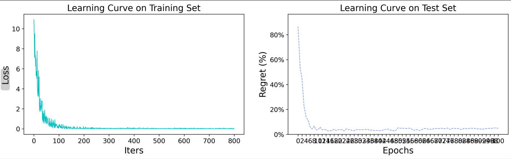

## PyEPO 

In this repository you will find:

1. A Multi-Skilled Traveling Salesman class in a compatiple format to PyEPO. View file: `tsp.py`.
2. Updated objective function to take in considerations the changes made. View file: `tsp.py`.
3. Visualization tool using folium. View file: `plot.py`.
4. Parameter intake from external files. The parameters are coordinate inputs and skill mapping. View directory: `.input_data/`

## Testing steps
#### - Multi-Skilled Traveling Salesman class
To test only the class performance, run file: `main.py`. The data used is from the files in the directory `input_data`.

The output should be something like:

#### - Multi-Skilled Traveling Salesman class
To test only the class performance, run file: `main.py`. The data used is from the files in the directory `input_data`.

The output should be something like:

> [!WARNING]
> With the attached data, the model will not run with the free version of Gurobi and a license is required. To run on a free license, limit the amount of coordinates to around 10.
